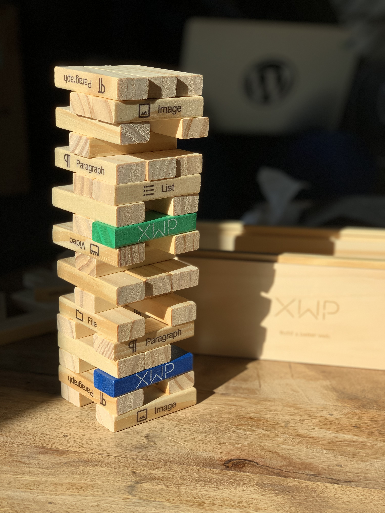

# Designer and Developer Handbook

Say Hello to [Gutenblox](http://gutenblox.fun/)!  👋 🧱

## Introduction

Using a system of Blocks to compose and format the game, the block-based structure is designed to create a rich and flexible layout for your game.

Blocks treat Paragraphs, Headings, Media, etc. all as components that strung together make up the tower. Replacing the traditional concept of board games, Gutenblox is designed with progressive enhancement, meaning as new blocks are added to the top of the tower, they are backward compatible with all legacy content (although the legacy structure may become unstable as new blocks are added on).

We hope to offer rich value to players who will start with the foundation of a stable, accessible, and secure architecture, and then use a simple drag-and-drop method for modification.

Advanced players may want to try using with hooks.

The fully reusable components will bring you, your team, and new visitors years of fun.

## Thank you!

XWP thanks you for helping us bring the best technology of the web to WordPress and contributing to the WordPress project. The future of the open web depends on your help.

